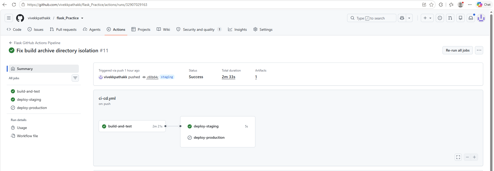

# Flask Web Application - CI/CD Pipeline Implementation

This repository contains automated Continuous Integration and Continuous Deployment (CI/CD) pipelines for a Flask web application using **Jenkins** and **GitHub Actions**.

---

## 1. Prerequisites & Setup

* **Cloud Server:** AWS EC2 Instance (`t2.medium`, Ubuntu 24.04 LTS)
* **Security Group Rules (Inbound):**
  * Port `22` (SSH)
  * Port `8080` (Jenkins Web Dashboard)
  * Port `80` / `5000` (HTTP / Flask Application)
* **Installed Software:**
  * Java 17 (`openjdk-17-jdk`)
  * Jenkins Server (`jenkins`)
  * Python 3 (`python3`, `python3-venv`, `python3-pip`)
  * Git & Rsync (`git`, `rsync`)

---

## 2. Jenkins CI/CD Pipeline

The Jenkins pipeline automates testing and local deployment on code updates.

* **Pipeline File:** `Jenkinsfile`
* **Trigger:** SCM Polling / GitHub Webhook on push to `main` branch.
* **Pipeline Stages:**
  1. **Build:** Sets up a Python virtual environment (`venv`), upgrades `pip`, and installs application dependencies from `requirements.txt`.
  2. **Test:** Executes automated unit tests using `pytest` (with fallback error handling).
  3. **Deploy to Staging:** Syncs compiled application files to the target deployment path `/var/www/flask_staging/` using `rsync`.

---

## 3. GitHub Actions CI/CD Pipeline

The GitHub Actions workflow automates testing, artifact packaging, and environment deployments across multiple branches.

* **Workflow File:** `.github/workflows/ci-cd.yml`
* **Branch Strategy:**
  * Push to `main` $\rightarrow$ Triggers **Build & Test** job.
  * Push to `staging` $\rightarrow$ Triggers **Build & Test** job followed by **Deploy to Staging**.
  * Tagged Release $\rightarrow$ Triggers **Build & Test** job followed by **Deploy to Production**.
* **Workflow Steps:**
  1. **Checkout Code:** Pulls latest code state using `actions/checkout@v4`.
  2. **Set up Python:** Configures Python 3.10 runtime using `actions/setup-python@v5`.
  3. **Install Dependencies:** Upgrades `pip` and installs dependencies.
  4. **Run Tests:** Executes `pytest` with simulated database environment variables.
  5. **Build Application Package:** Packages application code cleanly into `app-build.tar.gz` and uploads it via `actions/upload-artifact@v4`.
  6. **Deploy:** Downloads build artifacts and deploys to destination hosts using encrypted deployment secrets.

---

## 4. Environment Secrets Configuration

To run the GitHub Actions deployment jobs successfully, configure these secrets under **Settings > Secrets and variables > Actions**:

* `STAGING_HOST`: Target server IP address for staging deployment.
* `PROD_HOST`: Target server IP address for production deployment.
* `DEPLOY_KEY`: SSH Private Key (`.pem`) for authenticating deployment actions.

---

## 5. Pipeline Execution Screenshots

### Jenkins Pipeline Execution

### GitHub Actions Workflow Execution

---

## 5. Pipeline Execution Screenshots

### Jenkins Pipeline Execution

### GitHub Actions Workflow Execution

